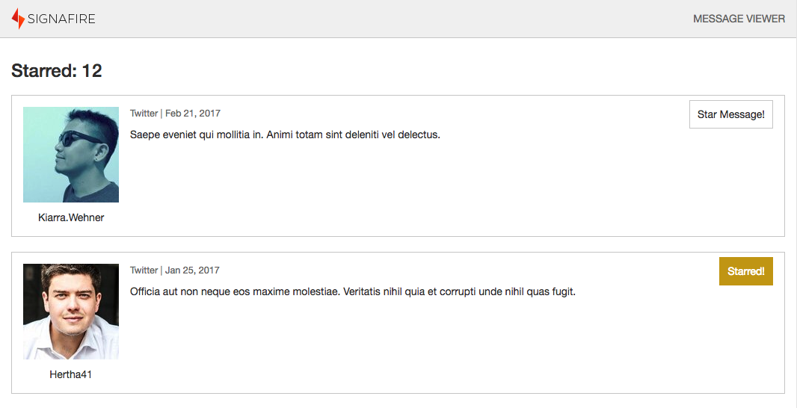

# Signafire Front End Challenge

Welcome to the Signafire Front End Challenge! This exercise is intended to allow you to display your ability to perform basic web development tasks 
and build a few features in an Angular application.

The goal is to retrieve the message data from a server, display the data on the page, and enable the user to "star" messages of interest. You will 
be provided with a simple JSON server that serves fake Twitter-like message data, as well as a the basic foundation of an Angular application with a 
bit of styling. All of the key packages you should need to complete the exercise have been included in the package.json, but if you'd like to use a 
library such as Lodash or Immutable.js, feel free to install it.

The exercise is intended to be straightforward and should take no longer than 1 - 2 hours. During your in-person interview, you will be asked to 
present your work and should be prepared to answer questions about building out the app further (e.g. new features, added complexity, etc).

A few important notes:
- You should use more than just the single component provided in the seed project to build out the app. Component-based architecture is the way of the modern web, 
and here at Signafire we strive to make our components as self-contained and reusable as reasonably possible.
- We are mainly looking to see your ability to wire up and build out an Angular app, so please do not spend too much time on styling. We have 
provided a screenshot below as a suggestion of what level of styling we are looking for.
- **Do not add your SSH key to this directory!** Other people will be viewing this directory. You should only need the credentials you were provided to clone the repository and pull with Git
- **Please do not commit directly to this repository!** When you are finished, please post to your personal GitHub account and email a link to Zach (zach@signafire.com) 
and Luciano (luciano@signafire.com) so that we can review it. Also if you have any questions, don't hesitate to ask!

---

### Main requirements
- Retrieve message data from the server
- Display a list of messages
- Each message object has a flag named "isStarred"; this flag should be toggleable by a button in the UI
- You should display the number of starred messages somewhere on the page

### Extra credit
- Add a filter to show only starred or unstarred messages
- Add a text search box that filters the list of message by a specific text query (note: this is intended to be an front-end only filter; it does not 
need to interact with the API)

---

### Project set up

1) Clone the repo using the HTTPS link and the credentials provided to you.
```git clone https://gitlab.signafire.com/external/signafire-challenge.git```

2) Move into the new "signafire-challenge" directory and NPM install

3) Start the app by running `npm run start`. This will start the webpack-dev-server via the Angular CLI, as well as the JSON server that serves the message data.
The app server will be running at http://localhost:4200, while the JSON server will be available at http://localhost:3000.

4) The API for messages can be found at: `http://localhost:3000/messages`

5) Code!

---

### Sample Screenshot

The following is a sample screenshot demonstrating the level of styling that is acceptable:


